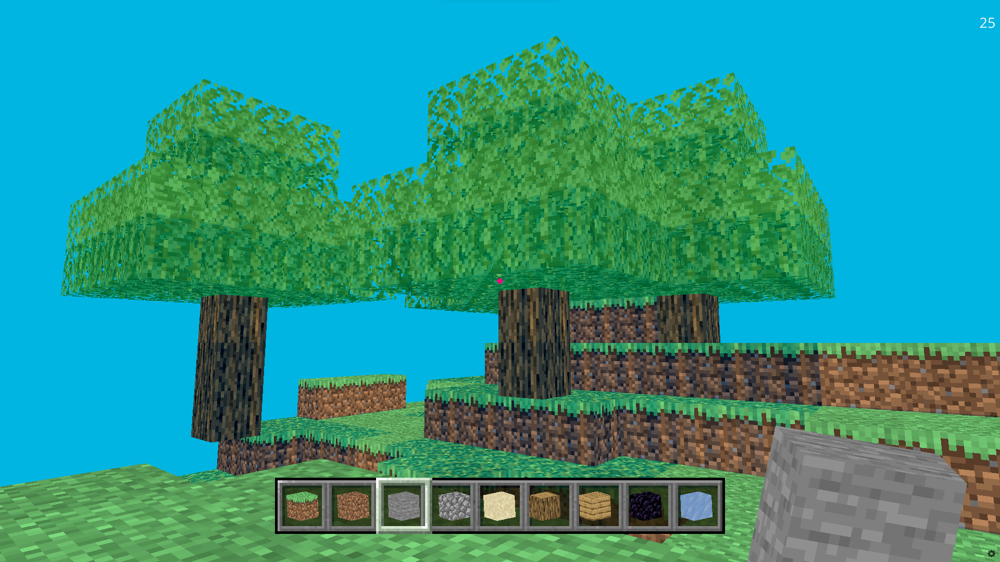
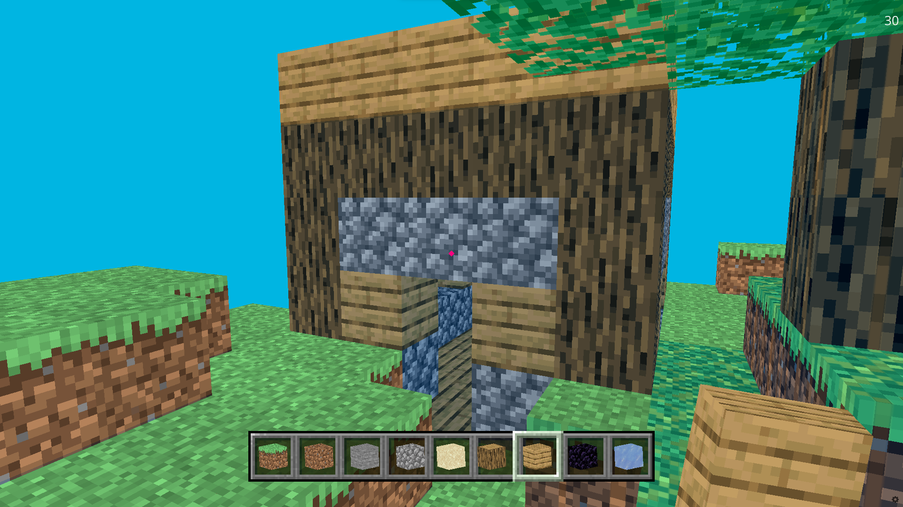
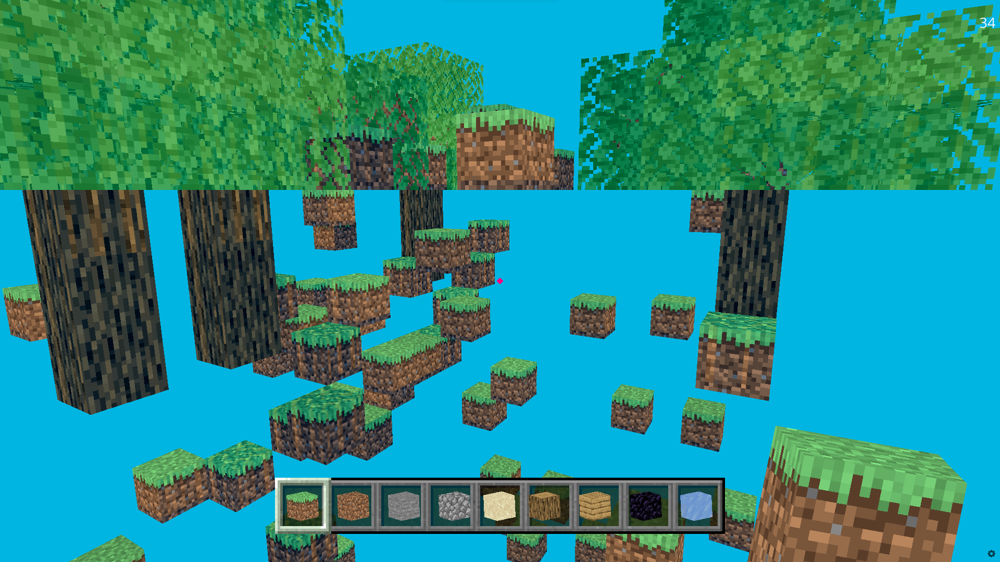
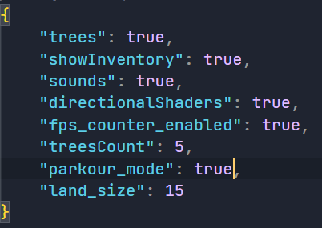

# Minecraft-Python-Edition

This is a Final Update to Pyinecraft.
This is the 5th clone of Minecraft I am trying to make.
There are 4 Repositories in my account of minecraft clones.

This Minecraft clone beats of all the other Repositories I made.

## Features

Trees that generate on their own. 
Real-time hotbar. 
3D textures for the hotbar. 
Random Sounds based on blocks. 
Spawn and Death sounds. 

## How to play

W -> forward 
A -> left 
S -> back 
D -> right 

T -> spawn tree 
ESC -> Quit 

## Extreme Amplified Parkour

So I was just testing, and increased the amplifier to 100.
Then I found out that it can act as a extreme parkour course.

## Extensible Json

I also made a json file to configure most stuff in the game.
It will look something like this:

*The parkour mode is on, that is not the default.*

## Bugs

* Some trees float
* You cannot place blocks on trees
* You can spawn inside a block. Jumping should fix the problem!

### If any unexpected stuff appears feel free to make a issue about it!

